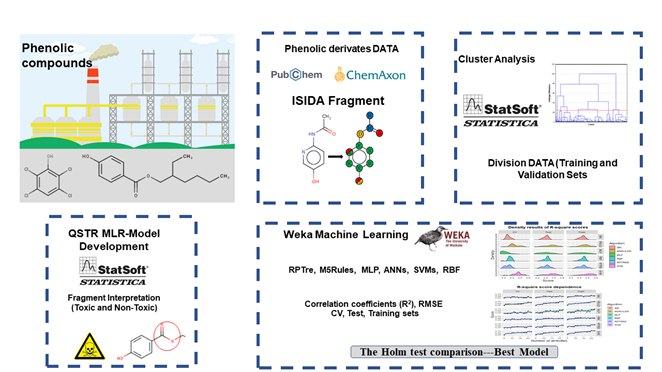

# Chemical Substructures in an Explainable Machine Learning Model to identify the ecotoxicity risks factors in T. pyriformis

Author: Gerardo M Casanola-Martin & Karel Dieguez-Santana

-------------------------------------------------------------------------------------------------

** MLR structural fragment model to detect structural alerst for Tetrahymena pyriformis ecotoxicity**

The Tpyriformis ML predictor is a Web App that use MLR regression models to predict using a chemical fragments and Tetrahymena pyriformis species as a target. 
